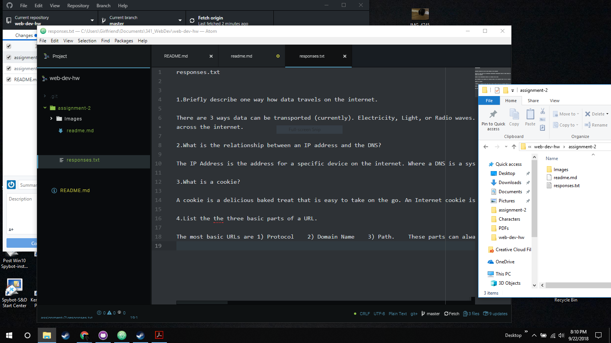

# ReadMe-A2

B.) Version control systems are very important for most projects, to allow multi-source editing. Meaning that multiple people can edit the same source of code and recombine them without requiring manually incorporating the changes made by both users. In addition, version control allows branches in development. Allowing us to experiment with changes, and utilizing multiple attempts at different systems that do not need to be lost. By creating a branch, different systems can be edited, and altered without fear of corrupting the old code. Therefore if something does go wrong, we can reverse back to a time when everything functions normally.

C.) [responses](./responses.txt)

D.) My work cycle was mostly tedious. I am fairly familiar with the Markup language already. This meant most of the work was going through the processes and answering the questions. Watching the interviews and detailed look into the internet was interesting, and engaging. Overall, fairly straight forward.

E.)

