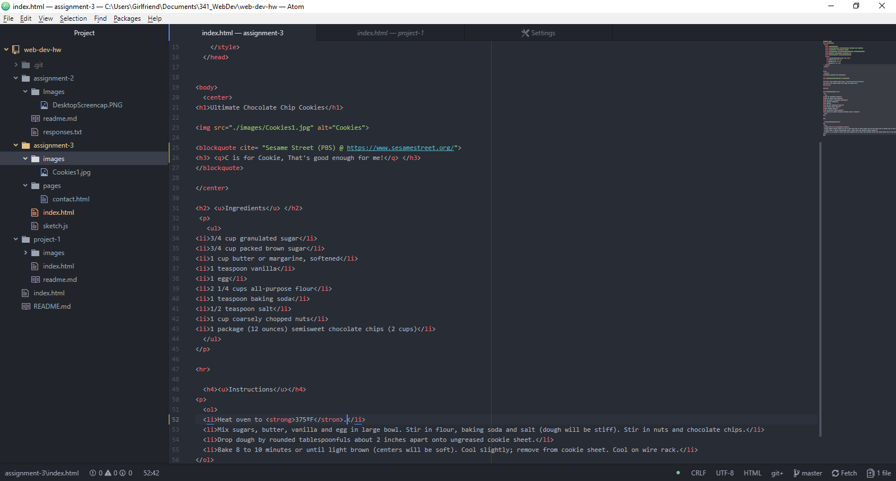

# Technical Report

B) HTML can only have one main head element and only one main body element. These are separated to the set-up and execution. The head element sets up the document format and styling. While the body element is what is actually displayed.

C) Structural markup is the function, and layout of the page. Semantic markup is the text displayed on that webpage, and how it appears.

D) This assignment went slower than the others. Mainly because I couldn't think of a good recipe. Going over the new syntax of the META element was a little time consuming. Once I got it working, multiple revisions to get the feel finalized.

