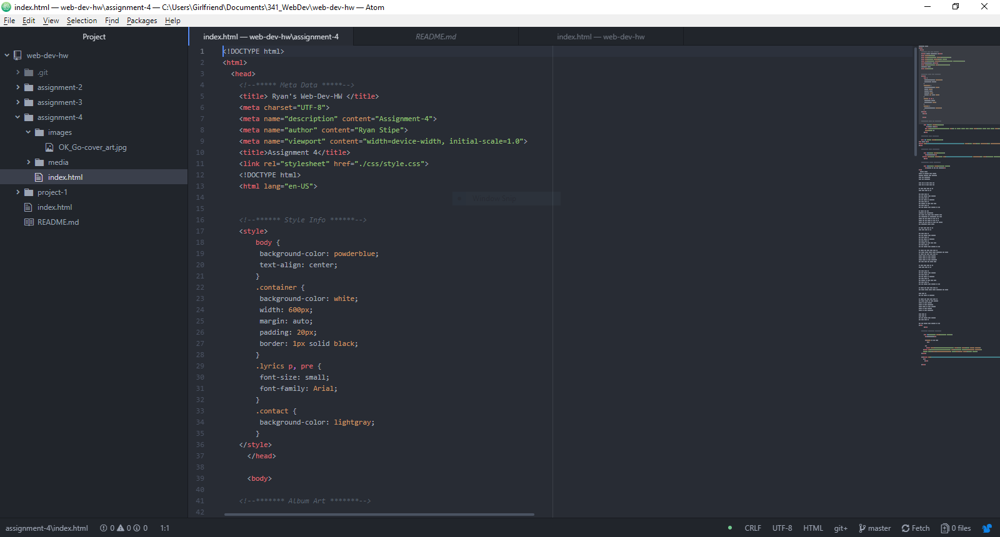

# Technical Report

B)
Ids are global identifiers. Divs allows grouping elements together. Spans name div elements. Classes are used for HTML without a CSS, and can be used grouped elements together.

C)
Alt Text is important for both the dev, and the user. As if something goes wrong, the description needs to be visible. This helps the developer to know what went wrong, and helps the user understand the intention, and the content of the site.

D) This assignment was very streamlined for me. Most of my previous experience with HTML has focused on embedding, and linking media. Most of this was a walk in the park for me. Some of the style & meta data still seem redundant, and slightly confusing to me. Most of the creative work was given to us, so not many choices had to be made for this assignment. Excluding picking a song.

