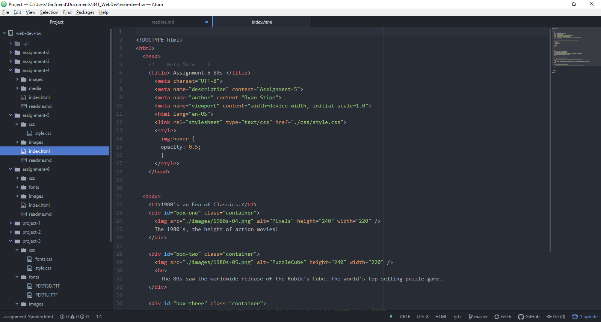

# Technical Report A5

B.) Due to the somewhat limited options for images to include, I chose to use them to explore aspects of the 1980's that are still relevant today. Mainly the 80s movies, and as seen in my project-2, the Rubik's cube.

C.) The color pallet I chose was meant to reflect the Rubik's Cube and the muted colors of the 80's style. Meaning a faded red (rgb(255, 65, 65)), gold, and lightblue.

D.) My work cycle was very straight forward. Mainly just fine-tuning the positioning of the elements to get it to flow together.

E.)

