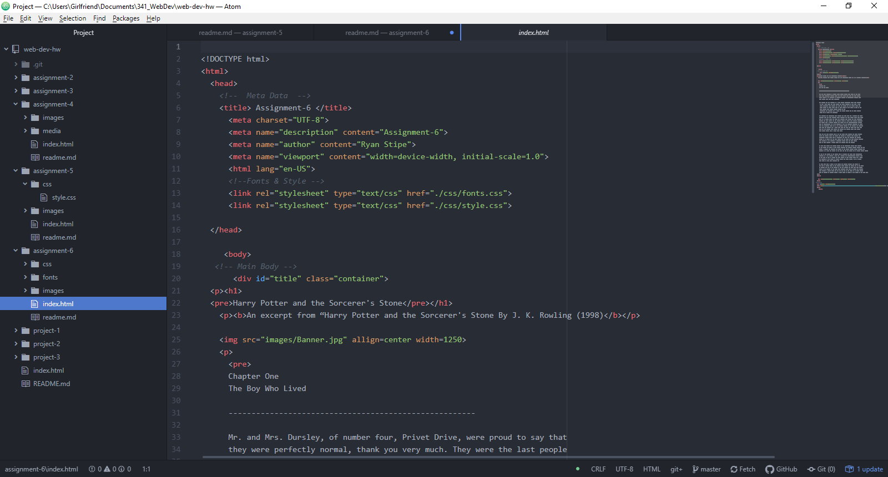

# Technical Report A-6

B.) The design of this page, I really wanted to emulate the feeling of the books. The pale colors were chosen to seem like the literal pages of the books. The boarder was colored red to reflect the Gryffindor house. The fonts were chosen because of the legibility and the fantastical aspects. The hand-written style font was chosen to emulate the quill-work found within the books.

C.) What is the difference between a system font, web font, and web-safe font? What is the importance of having fallback fonts or a font stack?
A system font is a font found locally on a computer, if is not found locally it will not be displayed. A web font is uploaded into the content of the website, and therefore should always be available. A web-safe font most browsers and computers should have access to. Fall back fonts are important incase the primary font is not available in the browser.

D.) This section I struggled with, getting the fonts to work perfectly was frustrating. Until I realized a simple mistake of calling style.css twice. After that was resolved, getting to the overall aesthetic was straightforward and fun.

E.)

