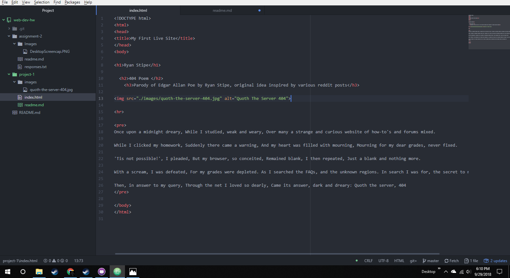

# Project-1 ReadMe

B.) My primary browser is Google-Chrome. I use this primarily while surfing, and personal use because of the integrations with all the other google platforms. While developing, or troubleshooting, I utilize a combination of Google-Chrome (on PC and Mobile), Microsoft-Edge, Microsoft-Internet Explorer, and Mozilla-Firefox. These browsers utilize different interpreters, and render engines. Thus giving me the ability to test on a wider delivery, and ensuring consistency within all browsers. I use these to get the widest variety available to me. As I do not own a Macintosh, I cannot test on Safari, or Opera. All browsers operate similarly, but use different systems. The layers are all  the same in the browser development. All browsers require a User Interface (UI), a Render Engine, a Browsing Engine (which communicates with the render engine.), access to a network/internet, a script interpreter, and data storage. All these systems interact to form a browser that can be used without detailed knowledge of networks.

C.) I used the "Wayback Machine" to visit a few sites in the early 2000s. I mainly spent time exploring the history of YouTube.com. Early on, youtube was a very different experience than it is today. Originally, youtube had many more url links, and text in general. On a website made up of video sharing, the amount of text overall has significantly decreased over time. The links are more streamlined now, and easily hidden. However, I feel the older versions of youtube may have been easier to understand. Every link was blue, and underlined. Thus creating an understanding of what you were clicking on. Youtube today undoubtedly looks better, and is far more pleasing. One could argue that as YouTube has progressed, control has been taken from the user.

D.)  My work cycle was far more cyclical this time. I spent most of this project following instructions based on what I knew, then double checking, and adjusting accordingly. I find, when time allows, failure is a very powerful learning tool. By making attempts, and learning where/if I went wrong helps me understand the code in more detail.

E.) 
