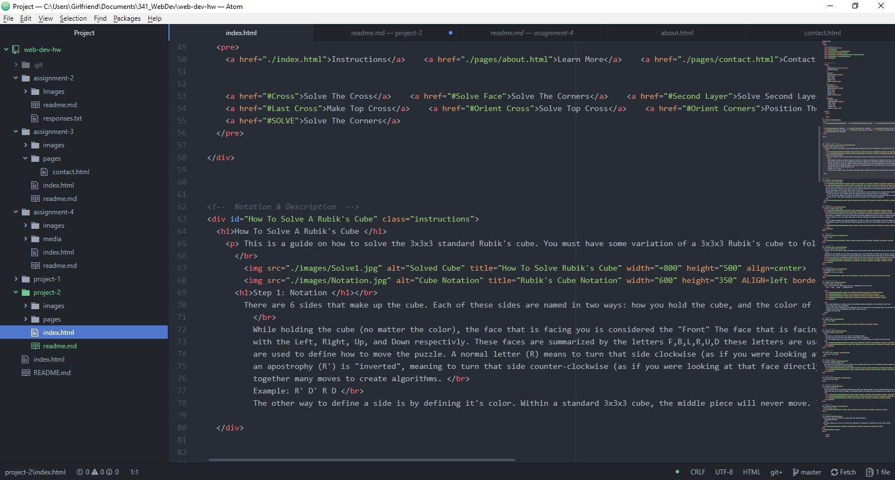

# Cube Technical Report

#### B.) Briefly recap your experience learning HTML. What was old, new, interesting, or difficult to learn?

While learning HTML, it has been a rollercoaster. Some things have been very easy for me, as I have some experience with the language previously. Yet some things still allude me. I still struggle at times with getting all the style and div elements to work properly. However, in my experience, these types of problems persist no matter what language. It seems like just a quirk of the coding process.

#### C.) Next Topic we begin CSS and expand on styling, which helps us "decorate" HTML. Is there anything you're anxious or excited to learn about in this new section?

I'm excited to hopefully learn ways to streamline the style systems. Previously, to get the look I'm after, it can take lots of code with lots of trial and error.

#### D.) Summarize your work cycle for this assignment.

My work cycle was long this time. Before I got coding, I had to capture the images, then edit and prepare them for the web. Much of my time coding was spent fine-tuning positions of images and text wrapping. Not exactly streamlined work, but I am very satisfied with the outcome. Even though the style was a fight the whole time.

E.) 
