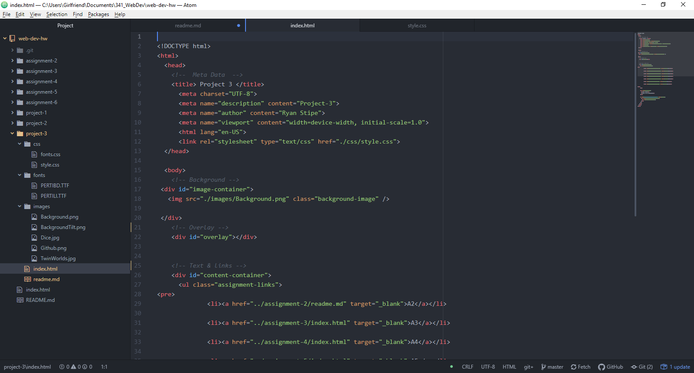

# Technical Write-Up

B.) Margins is the spacing between an element and its surrounding areas.  While borders are visible borders put around an element. Padding is used inside a normal border.

C.)  The hardest part for me was getting the overlapping to work well. Some struggles included transparency extending past the page size. As well as lining up the links with the formatting of the page. Some of the style elements were challenging for me.

D.) My work cycle was more challenging than the other assignments. Mainly because I didn't have a definitive idea from the start. I frequently had to reference the example and tutorials to properly troubleshoot.

E.)

